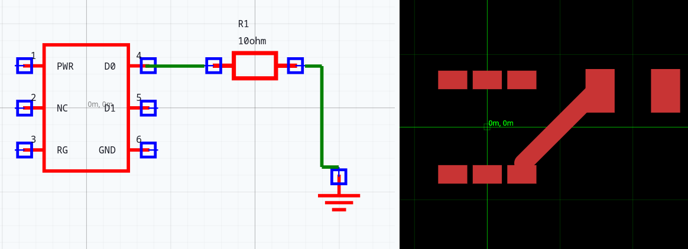
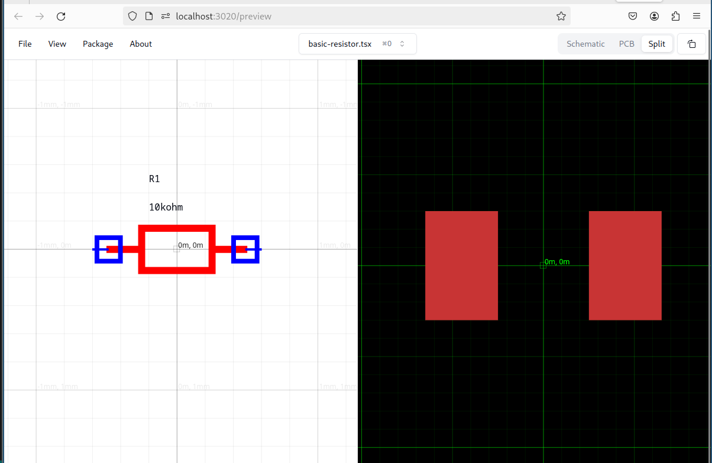

# ⏣ tscircuit - React for Circuits

[Docs](https://docs.tscircuit.com) &middot; [Website](https://tscircuit.com) &middot; [Twitter](https://twitter.com) &middot; [Campfire](https://tscircuit.com/community/join-redirect) &middot; [Quickstart](https://docs.tscircuit.com/quickstart) &middot; [Online Playground](https://tscircuit.com/playground)

Make electronics using Typescript and React.

```
npm install -g tscircuit
```

`tscircuit` is a library complemented by a registry, package manager, and command line tool that makes it easy to create, share, export and manufacture electronic circuits.

```tsx
const Circuit = () => (
  <board width="50mm" height="50mm" center_x={0} center_y={0}>
    <MySubcomponent
      name="U1"
      center={[0, 0]}
      footprint="sot236"
    />
    <resistor
      x={2}
      y={-0.5}
      name="R1"
      resistance="10ohm"
      footprint="0805"
      pcb_x="4mm"
      pcb_y="-1mm"
    />
    <ground x={3} y={1} name="GND" />
    <trace path={[".B1 > .D0", ".R1 > .left"]} />
    <trace path={[".R1 > .right", ".GND > .gnd"]} />
  </board>
)
```




https://github.com/tscircuit/tscircuit/assets/1910070/63610730-41e6-4a00-9748-e4c3691e5ca9


## Getting Started

You can do everything you need to do with `tscircuit` using the [`tsci`](https://github.com/tscircuit/cli) command line tool.

```bash
npm install -g tscircuit

tsci dev
```

> Open your browser to http://localhost:3020!

> 

## Development Sub-Projects / Organization

tscircuit includes a lot of different independently-runnable sub-projects. Here's
a quick guide to navigating all of the sub-projects:

### Core Libraries

| Project                                                                      | Description                                                                                              |
| ---------------------------------------------------------------------------- | -------------------------------------------------------------------------------------------------------- |
| [@tscircuit/builder](https://github.com/tscircuit/builder)                   | A typescript-native library for building circuits (no React). Converts typescript into "the soup format" |
| [@tscircuit/cli](https://github.com/tscircuit/cli)                           | The tscircuit command line tool `tsci` and development environment                                       |
| [@tscircuit/schematic-viewer](https://github.com/tscircuit/schematic-viewer) | The Schematic renderer                                                                                   |
| [@tscircuit/pcb-viewer](https://github.com/tscircuit/pcb-viewer)             | The PCB renderer                                                                                         |
| [@tscircuit/react-fiber](https://github.com/tscircuit/react-fiber)           | Bindings from builder to React, React types                                                              |

### Other Projects

- [tscircuit.com](https://tscircuit.com) - The official tscircuit website
- [registry.tscircuit.com](https://registry.tscircuit.com) - The official tscircuit registry that hosts re-usable tscircuit components
- [Community Slack](https://tscircuit.com/slack)
