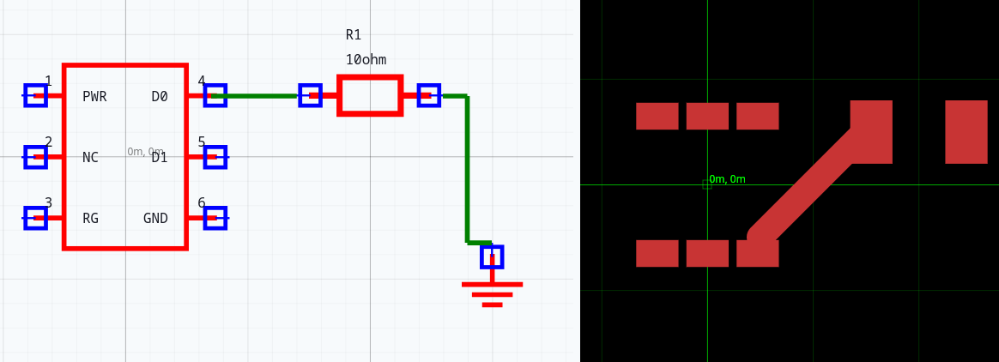
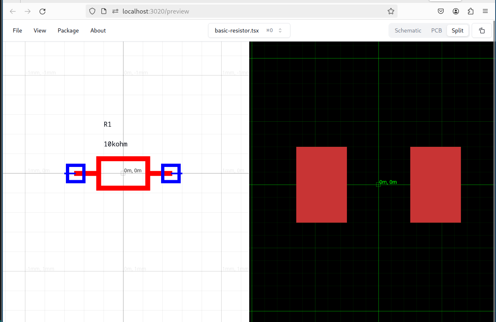

# tscircuit - React for Circuits

Make electronics using Typescript, React, and AI tools.

tscircuit makes developing electronics like web development. Edit code in your favorite IDE and watch the changes
create electronics in realtime. When you're done, [export your project and manufacture](https://docs.tscircuit.com/guides/understanding-fabrication-files)!

Get started by running `npm install -g tscircuit`! [(CLI quickstart doc)](https://docs.tscircuit.com/intro/quickstart-cli)

<div>
<a href="https://tscircuit.com/join" target="_blank">Discord</a>
·
<a href="https://tscircuit.com" target="_blank">Website</a>
·
<a href="https://docs.tscircuit.com" target="_blank">Docs</a>
·
<a href="https://blog.tscircuit.com/" target="_blank">Blog</a>
·
<a href="https://tscircuit.com/playground" target="_blank">Online Playground</a>
·
<a href="https://docs.tscircuit.com/quickstart" target="_blank">Quick Start</a>
·
<a href="https://github.com/tscircuit/tscircuit/issues" target="_blank">Issues</a>
·
<a href="https://x.com/tscircuit" target="_blank">Twitter</a>
·
<a href="https://docs.tscircuit.com/llms.txt">llms.txt</a>
·
<a href="https://share.cleanshot.com/XkJKK2ys">Getting Started Contributor Video</a>

</div>
<br/>

<div style="display: flex; gap: 10px">
  <a href="https://console.algora.io/org/tscircuit/bounties?status=completed">
       
   </a>
   <a href="https://console.algora.io/org/tscircuit/bounties?status=open">
       
   </a>
  <a target="_blank" href="https://tscircuit.com/join"></a>
  <a target="_blank" href="https://www.npmjs.com/package/tscircuit"></a>
  <a target="_blank" href="https://github.com/tscircuit/tscircuit/stargazers"></a>
</div>

</div>


https://github.com/user-attachments/assets/e0fc9f05-691f-422e-816a-1854c4ffc02d


1. [What is tscircuit?](#about-tscircuit)
2. [Examples](#example-circuits)
3. [Getting Started](#getting-started)
4. [Features](#more-features)
5. [FAQs](#faq)
6. [Development Sub-Projects / Organization](#development-sub-projects--organization)
7. [Other Links](#other-links)

---

## What is tscircuit?

`tscircuit` is a library complemented by a registry, package manager, command line tool and AI electronic design suite that makes it easy to create, share, export and manufacture electronic circuits. It uses
[React Fiber](https://docs.pmnd.rs/react-three-fiber/getting-started/introduction) to render circuits into web pages.

Think of tscircuit as "React for Electronics" It allows you to design real-world electronic circuits using Typescript and React. This is what tscircuit code looks like, instead of creating web element like “div”, you create circuit elements like “chip”, “resistor” or “capacitor”, then instead of rendering a website, we render a 3d circuit (that you can actually order!)

Using tscircuit, you can design things like a <a target="_blank" href="https://blog.tscircuit.com/p/battling-jlcs-assembly-interface" target="_blank">fully functional keyboard!</a> Once you've completed your design, you can export it to a manufacturer and order a real, functional circuit board!

## Example Circuits

- [ESP32 Wifi Breakout Board](https://tscircuit.com/seveibar/wifi-test-board-1)

```tsx
const Circuit = () => (
  <board width="50mm" height="50mm" center_x={0} center_y={0}>
    <MySubcomponent name="U1" center={[0, 0]} footprint="sot236" />
    <resistor
      x={2}
      y={-0.5}
      name="R1"
      resistance="10ohm"
      footprint="0805"
      pcb_x="4mm"
      pcb_y="-1mm"
    />
    <ground x={3} y={1} name="GND" />
    <trace path={[".U1 > .D0", ".R1 > .left"]} />
    <trace path={[".R1 > .right", ".GND > .gnd"]} />
  </board>
)
```

### 📦 Snippet: Arduino Nano V3.0

A production-grade, drop-in ready Arduino Nano V3.0 compatible module built with tscircuit.

**Key Features:**
- ATmega328P-AU (TQFP-32) + CH340G (SOP-16) USB-UART bridge
- Dual LDO power stage: AMS1117-5.0 & AMS1117-3.3 with full input/output filtration
- Precision timing: 16 MHz (MCU) + 12 MHz (USB) crystals with 22 pF load capacitors
- Auto-reset: 100 nF DTR capacitor + 10 kΩ reset pull-up
- 4 indicator LEDs: PWR (green), TX/RX (amber), D13 (yellow) with 1 kΩ current-limiting resistors
- AVCC analog supply filtering via ferrite bead + bypass capacitor
- USB VBUS OR-ing via Schottky diode (BAT54C)
- Full BOM with precise manufacturer part numbers — fabrication-ready

| Designator | Type | MPN / Value | Footprint | Qty |
|---|---|---|---|---|
| U1 | MCU (8-bit AVR) | ATmega328P-AU | TQFP-32 | 1 |
| U2 | USB-UART Bridge | CH340G | SOP-16 | 1 |
| U3 | 5 V LDO Regulator | AMS1117-5.0 | SOT-223 | 1 |
| U4 | 3.3 V LDO Regulator | AMS1117-3.3 | SOT-223 | 1 |
| Y1 | 16 MHz Crystal | ABLS-16.000MHZ-B2-F-T | HC-49/S | 1 |
| Y2 | 12 MHz Crystal | ABLS-12.000MHZ-B2-F-T | HC-49/S | 1 |
| C1, C2, C8, C9 | MLCC 22 pF | CL10C220JB8NNNC | 0402 | 4 |
| C3, C4, C6, C10, C15, C17, C18 | MLCC 100 nF | CC0402KRX7R9BB104 | 0402 | 7 |
| C5, C7, C13, C14, C16 | Tantalum 10 µF | TAJB106K016RNJ | 0805 | 5 |
| C11 | MLCC 100 nF (DTR) | CC0402KRX7R9BB104 | 0402 | 1 |
| R1 | 10 kΩ (Reset Pull-up) | RC0402FR-0710KL | 0402 | 1 |
| R2–R5 | 1 kΩ (LED current) | RC0402FR-071KL | 0402 | 4 |
| R6 | 1 MΩ (USB Shield) | RC0402FR-071ML | 0402 | 1 |
| D1 | Green LED (PWR) | 19-217/GHC-YR1S2/3T | 0402 | 1 |
| D2, D3 | Amber LED (TX/RX) | 19-217/Y5C-AP1Q2/3T | 0402 | 2 |
| D4 | Yellow LED (D13) | 19-217/Y5C-AM1N1VY/3T | 0402 | 1 |
| D5 | Schottky Diode | BAT54C | SOT-23 | 1 |
| FB1 | Ferrite Bead (AVCC) | BLM18RK102SN1D | 0402 | 1 |
| SW1 | Reset Pushbutton | PTS645SM43SMTR92 LFS | 4-Pin TH | 1 |
| J1, J2 | 15-pin Header F | PPTC151LFBN-RC | 2.54 mm TH | 2 |
| J3 | ICSP 2×3 Header | 67996-406HLF | 2.54 mm TH | 1 |
| J4 | Mini-USB B Connector | UX60SC-MB-5ST | SMD | 1 |

```tsx
import { ArduinoNano } from "@tscircuit/snippets/arduino-nano"

export const MyBoard = () => (
  <board width="60mm" height="26mm">
    <ArduinoNano />
  </board>
)
```



## Getting Started

You can do everything you need to do with `tscircuit` using the [`tsci`](https://github.com/tscircuit/cli) command line tool.

```bash
npm install -g tscircuit

tsci dev
```

> Open your browser to http://localhost:3020!

> 

## More Features!

- [x] Preview PCBs & Schematics in your browser
- [x] Use normal Typescript/React tooling
- [x] Export Gerbers, Pick'n'Place and BOM for manufacturing
- [x] Add [registry packages](https://tscircuit.com/) with `tsci add`
- [x] Publish subpackages to the registry with `tsci push`
- [x] Simplified, extensible auto-routing for PCBs
- [x] Import footprints and components from third-party sites 
- [x] Generate footprints from text [using AI](https://text-to-footprint.tscircuit.com)

## FAQ

### Is tscircuit free?

tscircuit is completely free and MIT-licensed open-source

### How does this work?

tscircuit uses the same thing that React Native and [react-three-fiber](https://docs.pmnd.rs/react-three-fiber/getting-started/introduction) use to render to mobile or 3d to render PCBs and schematics (it's called [React Fiber](https://github.com/acdlite/react-fiber-architecture)!)

You can render schematics or PCBs in any React project like this:

```tsx
import { Schematic } from "@tscircuit/schematic-viewer"

export const MyApp = () => (
  <div>Regular web react here!</div>
  <Schematic>
   <resistor name="R1" resistance="10k" />
  </Schematic>
)
```

tscircuit has a bunch of extra tools and exports in the command line, so it's a bit easier to use `tsci dev` to develop circuits (you can always publish and import them later)

### Can I test this in my browser?

Yes! There is a [playground tool!](https://tscircuit.com/editor)

### Do I have to specify the position of every component?

Currently you should specify `pcbX`/`pcbY` for components (and nest inside `<group />`s for convenience!)

We are working on building the equivalent of "flex" and "CSS Grid" autolayout algorithms
for PCBs. Wherever an automatic placement is made, you'll be able to override it.

### Is the auto-routing good?

We are working towards a state-of-the-art web-based autorouting algorithm. You can follow the
progress of our autorouter development on [autorouting.com](https://blog.autorouting.com)

### I found a bug or have an idea for a feature, what should I do?

Please [create an issue](https://github.com/tscircuit/tscircuit/issues)!

### How can I follow along?

- [@seveibar](https://x.com/seveibar) is the main author, he tweets about tscircuit and does [development livestreams](https://www.twitch.tv/seveibar)
- [@tscircuit](https://x.com/tscircuit) for major tscircuit releases, features and discussions
- [tscircuit discord](https://discord.gg/6X3PYhtj) and [tscircuit campfire](https://tscircuit.com/community/join-redirect)

---

## Development Sub-Projects / Organization

tscircuit includes a lot of different independently-runnable sub-projects. Here's
a quick guide to navigating all of the sub-projects:

### Core Libraries

| Project                                                                      | Description                                                                                              |
| ---------------------------------------------------------------------------- | -------------------------------------------------------------------------------------------------------- |
| [tscircuit](https://github.com/tscircuit/tscircuit)                          | The main package, packages up everything into a single version                                           |
| [@tscircuit/core](https://github.com/tscircuit/core)                         | A typescript-native library for building circuits (no React). Converts typescript into "the circuit-json format" |
| [@tscircuit/cli](https://github.com/tscircuit/cli)                           | The tscircuit command line tool `tsci` and development environment                                       |
| [@tscircuit/tscircuit.com](https://github.com/tscircuit/tscircuit.com)       | The main website, playground and online development environment for tscircuit                            |
| [@tscircuit/schematic-viewer](https://github.com/tscircuit/schematic-viewer) | The Schematic renderer                                                                                   |
| [@tscircuit/pcb-viewer](https://github.com/tscircuit/pcb-viewer)             | The PCB renderer                                                                                         |
| [@tscircuit/react-fiber](https://github.com/tscircuit/react-fiber)           | Bindings from builder to React, React types                                                              |
| [@tscircuit/routing](https://github.com/tscircuit/routing)                   | Routing algorithms for schematic and PCB traces                                                          |
| [@tscircuit/autolayout](https://github.com/tscircuit/autolayout)             | Layout algorithms for schematics                                                                         |
| [@tscircuit/footprinter](https://github.com/tscircuit/footprinter)           | DSL for creating footprints                                                                              |
| [kicad-mod-converter](https://github.com/tscircuit/kicad-mod-converter)      | Convert kicad_mod files to and from JSON                                                                 |
| [@tscircuit/kicad-viewer](https://github.com/tscircuit/kicad-viewer)         | View the KiCad official footprints online                                                                |

## Other Links

- [tscircuit.com](https://tscircuit.com/) - The official tscircuit website, registry and playground
- [discord](https://tscircuit.com/community/join-redirect) - Join the community server where all the primary conversations happen
- [@seveibar](https://x.com/seveibar) - Twitter for author of tscircuit with dev sessions and upcoming features
