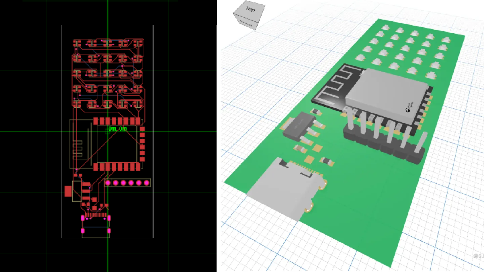

# ⏣ tscircuit - React for Circuits

<div style="display: flex; flex-direction: column;">
  <div>Make electronics using Typescript, React, and 
  <a href="https://text-to-footprint.tscircuit.com" target="_blank">AI</a>. 
  We recommend starting with our <a target="_blank" href="https://tscircuit.com/playground">online editor on tscircuit.com</a> <strong>(no sign-up required)</strong> rather than our CLI. <a target="_blank" href="https://tscircuit.com"><strong>Learn more »</strong></a>
  </div>
<br/>
  <div>
<a href="https://tscircuit.com/join" target="_blank">Discord</a>
·
<a href="https://tscircuit.com" target="_blank">Website</a>
·
<a href="https://docs.tscircuit.com" target="_blank">Docs</a>
·
<a href="https://blog.tscircuit.com/" target="_blank">Articles</a>
·
<a href="https://tscircuit.com/playground" target="_blank">Online Playground</a>
·
<a href="https://docs.tscircuit.com/quickstart" target="_blank">Quick Start</a>
·
<a href="https://github.com/tscircuit/tscircuit/issues" target="_blank">Issues</a>
·
<a href="https://x.com/tscircuit" target="_blank">Twitter</a>

</div>
<br/>

<div style="display: flex; gap: 10px">
  <a target="_blank" href="https://tscircuit.com/join"></a>
  <a target="_blank" href="https://www.npmjs.com/package/tscircuit"></a>
  <a target="_blank" href="https://github.com/tscircuit/tscircuit/stargazers"></a>
</div>

</div>

## Meet Founder of TSCircuit - Seve! 👋⚡

https://github.com/tscircuit/tscircuit/assets/1910070/63610730-41e6-4a00-9748-e4c3691e5ca9

## Table of Contents 🧾

1. [About tscircuit](#about-tscircuit)
2. [Examples](#example-circuits)
3. [Getting Started](#getting-started)
4. [Features](#more-features)
5. [FAQs](#faq)
6. [Development Sub-Projects / Organization](#development-sub-projects--organization)
7. [Other Links](#other-links)

---

## About tscircuit

`tscircuit` is a library complemented by a registry, package manager, command line tool and AI electronic design suite that makes it easy to create, share, export and manufacture electronic circuits. It uses
[React Fiber](https://docs.pmnd.rs/react-three-fiber/getting-started/introduction) to render circuits into web pages.

Think of tscircuit as "React for Electronics" It allows you to design real-world electronic circuits using Typescript and React. This is what tscircuit code looks like, instead of creating web element like “div”, you create circuit elements like “chip”, “resistor” or “capacitor”, then instead of rendering a website, we render a 3d circuit (that you can actually order!) 🚀

Using tscircuit, you can design things like a <a target="_blank" href="https://blog.tscircuit.com/p/battling-jlcs-assembly-interface" target="_blank">fully functional keyboard!</a> Once you've completed your design, you can export it to a manufacturer and order a real, functional circuit board!

## Example Circuits

- [ESP32 Wifi Breakout Board](https://tscircuit.com/seveibar/wifi-test-board-1)

```tsx
const Circuit = () => (
  <board width="50mm" height="50mm" center_x={0} center_y={0}>
    <MySubcomponent name="U1" center={[0, 0]} footprint="sot236" />
    <resistor
      x={2}
      y={-0.5}
      name="R1"
      resistance="10ohm"
      footprint="0805"
      pcb_x="4mm"
      pcb_y="-1mm"
    />
    <ground x={3} y={1} name="GND" />
    <trace path={[".U1 > .D0", ".R1 > .left"]} />
    <trace path={[".R1 > .right", ".GND > .gnd"]} />
  </board>
)
```


## Getting Started

You can do everything you need to do with `tscircuit` using the [`tsci`](https://github.com/tscircuit/cli) command line tool.

```bash
npm install -g tscircuit

tsci dev
```

> Open your browser to http://localhost:3020!

> 

## More Features!

- [x] Preview PCBs & Schematics in your browser
- [x] Use normal Typescript/React tooling
- [x] Export Gerbers, Pick'n'Place and BOM for manufacturing
- [x] Add [registry packages](https://tscircuit.com/trending) with `tsci add`
- [x] Publish subpackages to the registry with `tsci publish`
- [x] Simplified, extensible auto-routing for schematics and PCBs
- [x] Generate footprints from text [using AI](https://text-to-footprint.tscircuit.com)

## FAQ

### Is tscircuit free?

tscircuit is completely free and MIT-licensed open-source

### How does this work?

tscircuit uses the same thing that React Native and [react-three-fiber](https://docs.pmnd.rs/react-three-fiber/getting-started/introduction) use to render to mobile or 3d to render PCBs and schematics (it's called [React Fiber](https://github.com/acdlite/react-fiber-architecture)!)

You can render schematics or PCBs in any React project like this:

```tsx
import { Schematic } from "@tscircuit/schematic-viewer"

export const MyApp = () => (
  <div>Regular web react here!</div>
  <Schematic>
   <resistor name="R1" resistance="10k" />
  </Schematic>
)
```

tscircuit has a bunch of extra tools and exports in the command line, so it's a bit easier to use `tsci dev` to develop circuits (you can always publish and import them later)

### Is this ready for production?

No! Although I've [ordered a fully assembled circuit](https://x.com/seveibar/status/1780803190101020720) [(source code)](https://github.com/tscircuit/blinking-led-circuit/blob/main/lib/MyCircuit.tsx), this project is still very very early!

### How does the registry work?

The tscircuit registry fully implements the npm registry. When you run `tsci init` a `.npmrc` file is created in your project so that any `npm add` or `npm install` for a package starting with `@tsci/*`
will go to the tscircuit registry instead of the npm registry.

```
# Example .npmrc
# This line says "any package from the org @tsci should use the tscircuit registry server
@tsci:registry=https://registry-api.tscircuit.com/npm
```

### Can I use a different registry?

Yes! You can use the same trick and modify the `.npmrc` file for your project. You can run your own npm registry with [verdaccio](https://verdaccio.org/)

### Can I test this in my browser?

Yes! There is a [playground tool!](https://tscircuit.com/playground)

### Do I have to specify the position of every component?

I'm working on autolayout functionality where you will hopefully only need to
tweak things like the spacing. The goal of anything auto

### Is the auto-routing good?

The auto-routing is very basic. You can adjust the paths by adding `pcb_route_hints`
to a `<trace />`. Over time, we'll get good, fast auto-routing algorithms and also
ways to "bake & cache" a route over a longer time period.

### Can I export into other tools for routing?

This isn't currently possible but a major current objective. If you're interested in writing a module that can convert [tscircuit soup JSON](https://docs.tscircuit.com/api-reference/advanced/soup)
into another editor's format, reach out on our [campfire](https://tscircuit.com/community/join-redirect)!!

### I found a bug or have an idea for a feature, what should I do?

Please [create an issue](https://github.com/tscircuit/tscircuit/issues)!

### How can I follow along?

- [@seveibar](https://x.com/seveibar) is the main author, he tweets about tscircuit and does [development livestreams](https://www.twitch.tv/seveibar)
- [@tscircuit](https://x.com/tscircuit) for major tscircuit releases, features and discussions
- [tscircuit discord](https://discord.gg/6X3PYhtj) and [tscircuit campfire](https://tscircuit.com/community/join-redirect)

### Does this use AI?

No, but AI is pretty good at generating circuits! Try it with copilot!

### What big features are coming?

- [ ] Type-safe traces
- [ ] Autolayout and autorouter improvements
- [ ] Layout and route "baking" for more complex routes/layouts
- [ ] Lots and lots of static analysis
- [ ] SPICE output!
- [ ] Export to other EDA tools
- [ ] Less bugs! A lot less bugs!

---

## Development Sub-Projects / Organization

tscircuit includes a lot of different independently-runnable sub-projects. Here's
a quick guide to navigating all of the sub-projects:

### Core Libraries

| Project                                                                      | Description                                                                                              |
| ---------------------------------------------------------------------------- | -------------------------------------------------------------------------------------------------------- |
| [tscircuit](https://github.com/tscircuit/tscircuit)                          | The main package, packages up everything into a single version                                           |
| [@tscircuit/builder](https://github.com/tscircuit/builder)                   | A typescript-native library for building circuits (no React). Converts typescript into "the soup format" |
| [@tscircuit/cli](https://github.com/tscircuit/cli)                           | The tscircuit command line tool `tsci` and development environment                                       |
| [@tscircuit/snippets](https://github.com/tscircuit/snippets)                 | The main website, playground and online development environment for tscircuit                            |
| [@tscircuit/schematic-viewer](https://github.com/tscircuit/schematic-viewer) | The Schematic renderer                                                                                   |
| [@tscircuit/pcb-viewer](https://github.com/tscircuit/pcb-viewer)             | The PCB renderer                                                                                         |
| [@tscircuit/react-fiber](https://github.com/tscircuit/react-fiber)           | Bindings from builder to React, React types                                                              |
| [@tscircuit/routing](https://github.com/tscircuit/routing)                   | Routing algorithms for schematic and PCB traces                                                          |
| [@tscircuit/autolayout](https://github.com/tscircuit/autolayout)             | Layout algorithms for schematics                                                                         |
| [@tscircuit/footprinter](https://github.com/tscircuit/footprinter)           | DSL for creating footprints                                                                              |
| [kicad-mod-converter](https://github.com/tscircuit/kicad-mod-converter)      | Convert kicad_mod files to and from JSON                                                                 |
| [@tscircuit/kicad-viewer](https://github.com/tscircuit/kicad-viewer)         | View the KiCad official footprints online                                                                |

## Other Links

- [tscircuit.com](https://tscircuit.com/) - The official tscircuit website, registry and playground
- [discord](https://tscircuit.com/community/join-redirect) - Join the community server where all the primary conversations happen
- [@seveibar](https://x.com/seveibar) - Twitter for author of tscircuit with dev sessions and upcoming features
